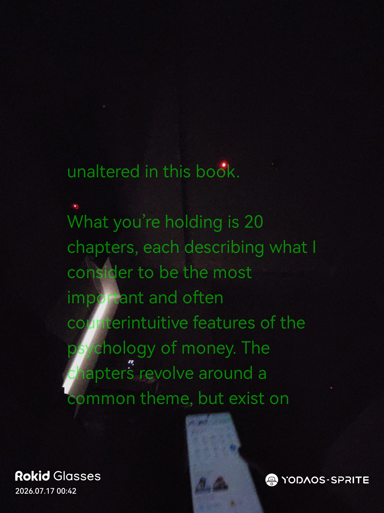
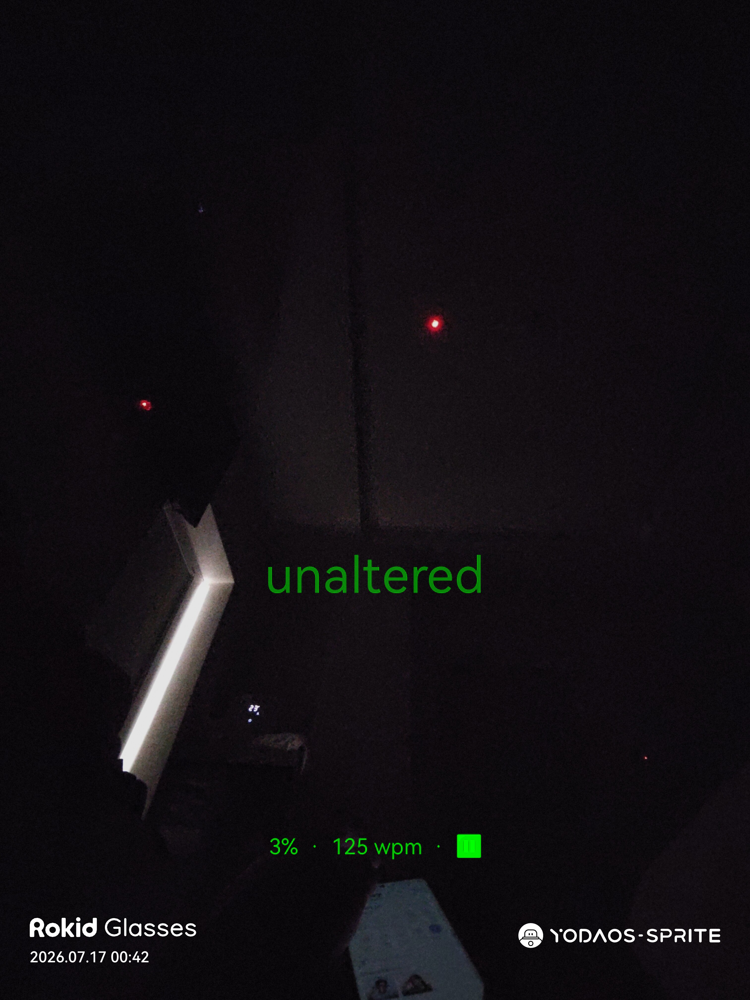
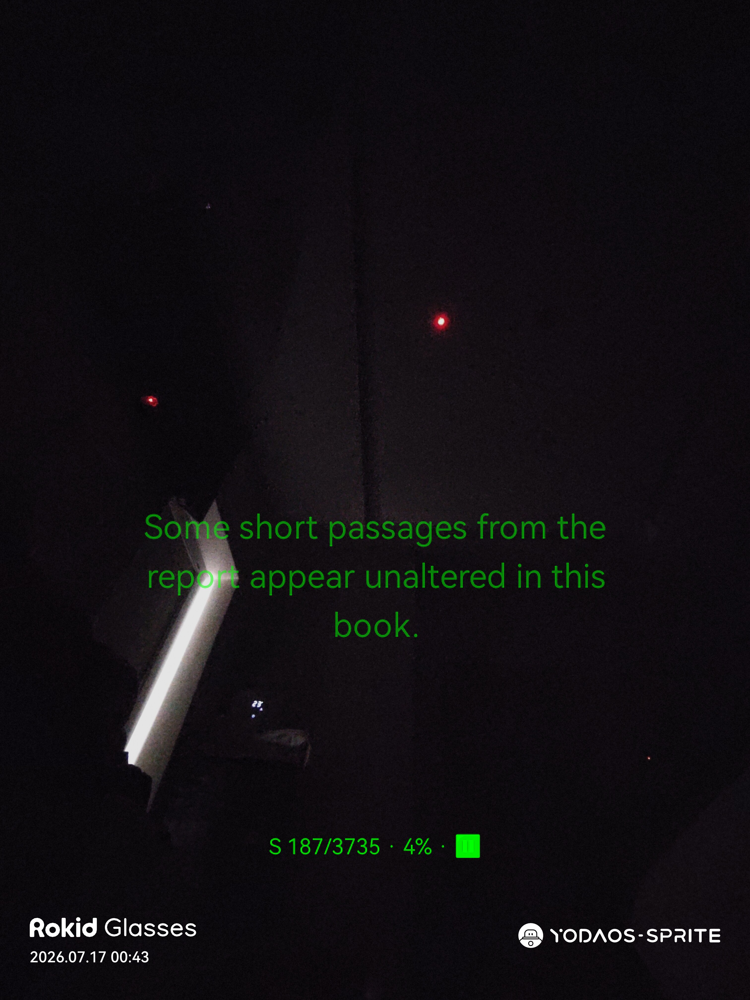
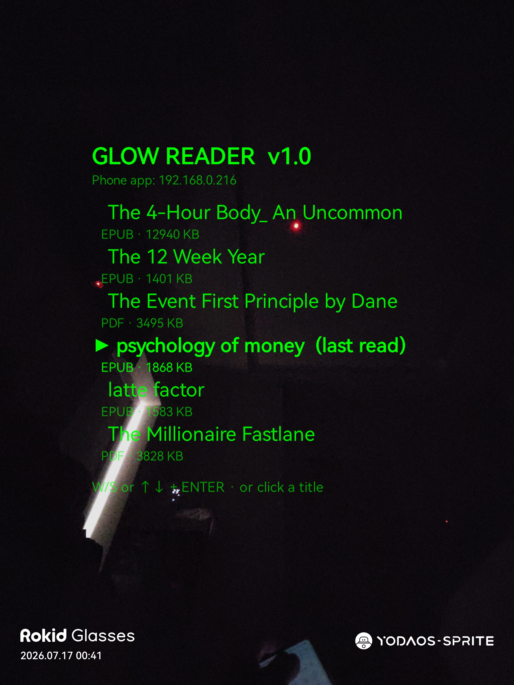
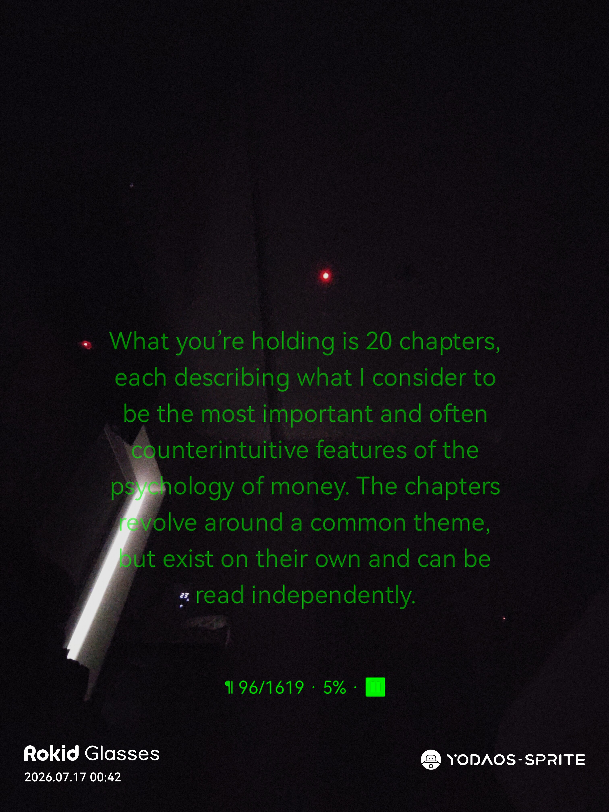
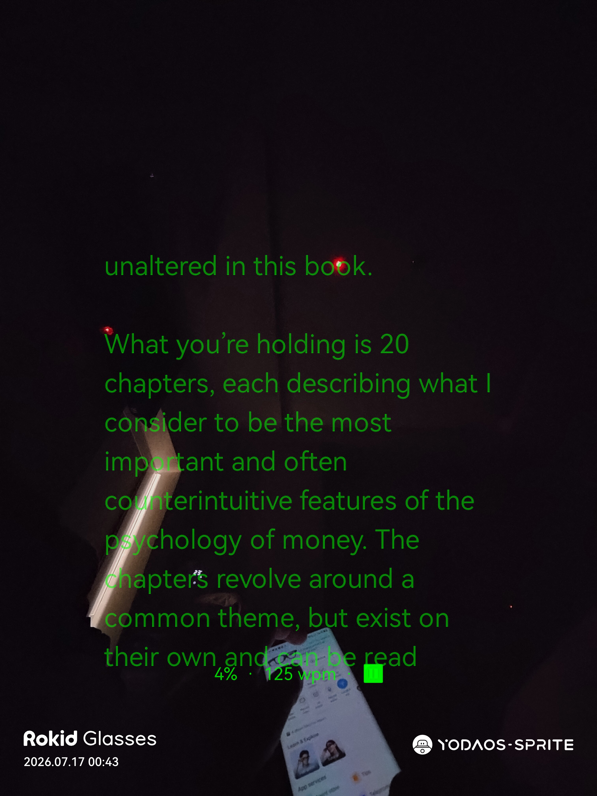
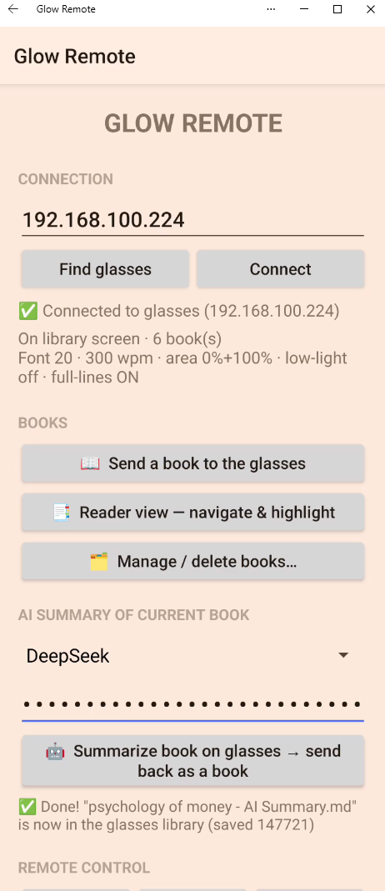
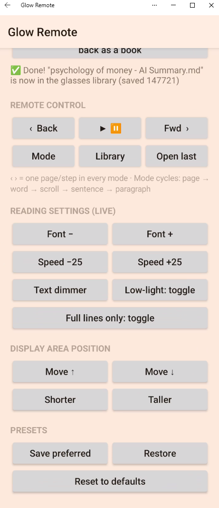

# Glow Reader 📖✨

**A book reader for Rokid AI Glasses that shows only floating words — no glowing background block.**

▶️ **[Watch the 2-minute demo on YouTube](https://youtube.com/shorts/FDaeNsjbpxM)**

[](https://youtube.com/shorts/FDaeNsjbpxM)

I'm not from an IT background — I'm a property agent and I don't understand a single line of code. This entire app was built by **[Claude Code](https://claude.com/claude-code)** (Anthropic's AI coding assistant). I just described what I wanted in plain English, tested it on my glasses, and told it what to fix.

## See it for yourself

Real captures from the glasses, reading in a dark room — the background is genuinely invisible, only the words float:

| Floating text (page mode) | One word at a time (RSVP) | Sentence mode |
|---|---|---|
|  |  |  |

| The library at night | Paragraph mode | Status line (wpm always visible) |
|---|---|---|
|  |  |  |

And the companion phone app — remote control, live settings, and the AI book summary (this one just finished summarizing *The Psychology of Money*):

| Main screen + AI summary | Remote & live settings |
|---|---|
|  |  |

*(A demo video is attached to the [latest release](../../releases/latest).)*

## The problem it solves

Reader apps sideloaded onto the glasses show up as a big glowing green block at night — the app background lights up the whole see-through display. Glow Reader's background is truly invisible: **all you see are floating words.**

> The technical fix, for the curious: on the glasses' waveguide display every non-black pixel glows green. A pure black app window *should* be invisible — but Android draws a translucent "focus highlight" over keyboard-navigated apps, which becomes a solid green slab. Glow Reader disables that (`android:defaultFocusHighlightEnabled=false`), along with every other system decoration that would light up.

## Features

- Reads **EPUB, PDF, TXT and Markdown** (PDFs are reflowed into clean, resizable text)
- **5 reading modes** (press `M` to cycle): page flip · word-by-word speed reading (RSVP) · teleprompter auto-scroll · sentence-by-sentence · paragraph-by-paragraph
- **"Close the book" gesture** — double-tap the temple and the display powers down to fully invisible (you stay in the book, position kept) so you can look someone in the eye; double-tap to keep reading. A faint veil fades out over ~5 seconds as the panel goes to sleep — after that it's true native transparency. If the display has fully slept, double-tap twice to reopen (first wakes the screen, second reopens the book).
- **Low Light mode** (`L`) + 5 text brightness levels (`T`) for night reading
- Adjustable display area — move/resize where the text floats (`U`/`N`/`O`/`P`)
- **Full-lines-only** rendering — no half-cut words at the scroll edges (`X`)
- Words-per-minute and progress always visible in a status line that never overlaps the text
- Remembers position, mode and settings per book; save/restore preferred settings (`V`/`R`)
- Books auto-appear from the glasses' **Download folder** (use the built-in browser), or push them from your phone
- **AI summary** (phone app): summarizes any book chapter by chapter with YOUR OWN API key (DeepSeek / OpenAI / Claude) in Short / Medium / Long versions — the summary lands in the glasses library as a readable book
- Delete books, update safely: updating the app never loses books, positions or highlights

## The two apps

| APK | Installs on | What it does |
|---|---|---|
| **GlowReader.apk** | the glasses | the reader itself |
| **GlowRemote.apk** | your Android phone | remote control + live settings + send books over WiFi |

Download both from **[Releases](../../releases)**.

## Controls

**Glasses temple touchpad:** single tap = play/pause · swipe = turn page · **double-tap = close/reopen the book (display powers off — truly invisible)**. While the book is closed, taps and swipes are ignored so you can't light the display by accident; if it has fully gone to sleep, double-tap twice to resume (wake, then reopen).

**Without the phone app:** any Bluetooth keyboard/mouse works (e.g. a free "Bluetooth Keyboard & Mouse" phone app). Arrows or `W/A/S/D` navigate, `SPACE` turns pages / plays / pauses, `ENTER` opens a book, `B` returns to the library, `H` shows the full key list on screen.

**With Glow Remote (phone app):** big buttons for everything — pages, font size, speed, brightness, display area — applied instantly on the glasses, plus one-tap "send a book to the glasses."
Requirements: Rokid Manager installed, glasses' **WiFi turned on and connected to the same WiFi network as your phone**. Open Glow Remote → tap **Find glasses** → it connects by itself.

## Install

1. Sideload `GlowReader.apk` onto the glasses the usual way (e.g. the install-APK option in the phone companion app).
2. On first launch the glasses will ask for **"all files access"** — that's so the app can see books in the Download folder.
3. Install `GlowRemote.apk` on your phone like any normal APK.

## Building from source

Both apps are plain Android/Kotlin projects with the Gradle wrapper:

```
cd GlowReader   # glasses app source
gradlew.bat assembleDebug
cd ../GlowRemote  # phone app source
gradlew.bat assembleDebug
```

Requires JDK 17 and the Android SDK (API 34).

## Credits

- **All programming: [Claude Code](https://claude.com/claude-code)** — including researching how other community apps solved the green-glow problem
- Inspired by the excellent open-source Rokid community apps in [awesome-rokid](https://github.com/Anezium/awesome-rokid), especially [Lume](https://github.com/beyondlevi/lume), whose source revealed the focus-highlight fix
- Not affiliated with Rokid — "works with Rokid Glasses" is a compatibility statement only

It's a hobby project made for my own night reading, so it's not perfect — but it works great for me and it's free. Feedback and ideas welcome! 🙂
